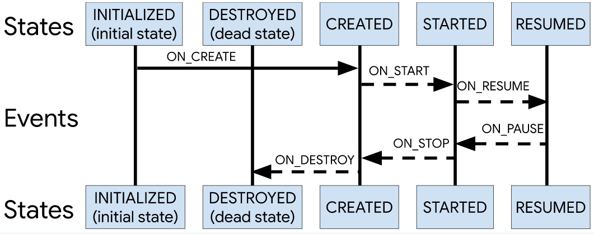

## Lifecycles

Android 프레임워크에 정의된 대부분의 앱 구성요소에는 수명 주기가 연결되어 있습니다. 수명 주기는 운영체제 또는 프로세스에서 실행 중인 프레임워크 코드에서 관리합니다. 또한 Android 작동 방식의 핵심으로, 애플리케이션은 수명 주기를 고려해야 하며, 그렇게 하지 않으면 메모리 누수 또는 애플리케이션 비정상 종료가 발생할 수 있습니다.

Lifecycles는 라이브러리 이름답게 생명주기 모니터링을 돕습니다. 크게 2가지로 구성되어 있는데, **1) Lifecycle Owner 2) Lifecycle Observer** 입니다.

### Lifecycle Owner?

Activity, Fragment에서 생명주기를 분리하여 Lifecycle 객체에 담습니다. Lifecycle 객체를 통해 다른 곳에서 해당 화면의 생명주기를 모니터링 할 수 있습니다. 자신의 생명주기를 담은 Lifecycle 객체가 Lifecycle Owner입니다.

### Lifecycle Observer?

생명주기를 Wrapping한 Lifecycle Owner 객체를 통해 화면 밖에서도 모니터링이 가능하지만, 생명주기에 따른 동작은 여전히 화면에서만 정의할 수 있습니다. 화면 밖에서도 생명주기에 따른 동작을 정의하기 위해서는 원하는 클래스에 LifecycleObserver 인터페이스를 구현하고, 넘겨받은 Lifecycle Owner 객체에 구현한 LifecycleObserver를 등록해야 합니다.

LifecycleObserver를 구현한 클래스는 OnResume() 등의 생명주기 메소드를 정의할 수 있습니다. 이 메소드들은 등록한 Lifecycle Owner가 해당 생명주기 상태가 되면 자동으로 수행되면서, 객체가 화면과 동일한 생명주기를 가진 것처럼 행동하도록 합니다.

## 결론

Lifecycles를 통해 우리는 화면 밖에서 화면의 생명주기를 모니터링하고, 동작을 정의할 수 있습니다. 이는 더 직관적인 생명주기 프로그래밍을 가능하게 합니다.

## Reference

https://medium.com/@maryangmin/android-architecture-components-%EC%86%8C%EA%B0%9C-1-8e04491be1f6

https://developer.android.com/topic/libraries/architecture/lifecycle?hl=ko
